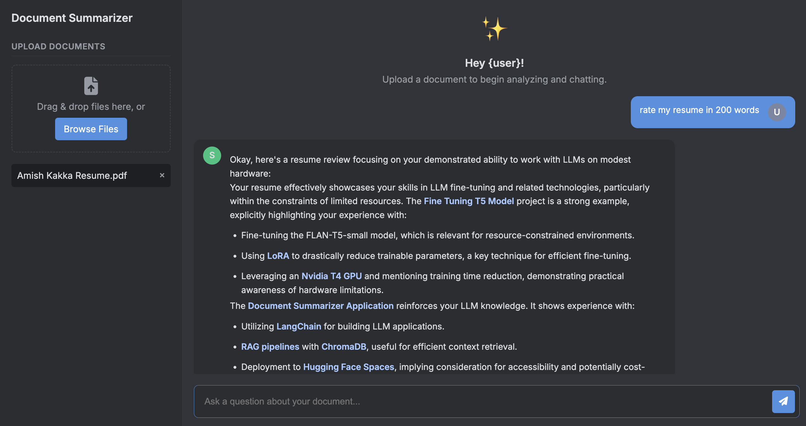
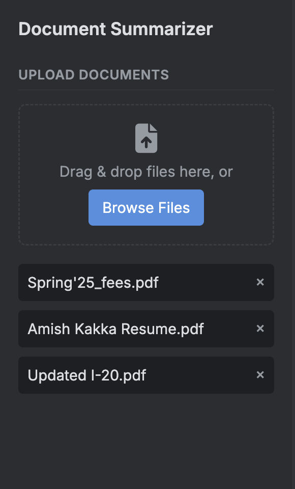

# Document-Summarizer v2.1

**Goal**: It is simple, upload your documents in PDF format (will work on changing this later like using docx and text files) and then query it. Get a short summary, or get detailed understanding of only a portion of the document, anything.

The beautiful interface is built using HTML/CSS and Javascript. The LLM that generates the answer to queries is Google's 'gemini-2.5-flash-lite' model. Access repo here - [Google GenAI](https://github.com/googleapis/python-genai)


Uploading document and then querying.


Uploading multiple documents at once.


# **Installation**  

1. Cloning the repository first.

```sh 
git clone https://github.com/AmishKakka/Document-Summarizer.git
```

2. Then, consider building a virtual environment so that there are no conflicts for the library versions.
```sh
python3 -m venv env_name
source env_name/bin/activate
pip install -r requirements.txt
```

3. You would need to create a Pinecone db instance, setup Firebase Authentication, create a GCS Bucket, and Firestore db if you want to replicate this entire project. 
For now you can access the project here - https://application-service-108871784288.us-west1.run.app/


4. Run the command below to access the application in your browser locally. 
```sh
uvicorn backend.main:app --reload
```

# **Pointers** 
1. The idea is to implement the concept Retreival-Augmented Generation (RAG) and the power of LLMs to generate relevant text.
2. To store the embeddings of the documents, Pinecone is used and accessed using the LangChain library.
3. You can now upload mutiple documents at a time and query any document.
